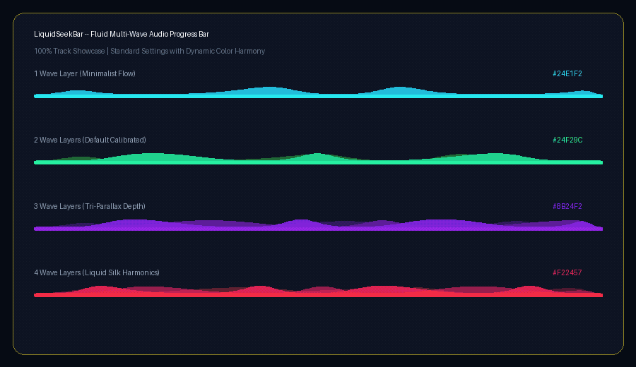

# LiquidSeekBar

A high-performance, fluid, organic multi-layered audio seekbar and progress component for modern web applications. Powered by HTML5 Canvas, quadratic Bezier splines, and mathematical trochoidal waveforms.

---

## Showcase (100% Track Coverage - 1 to 4 Waves)

<p align="center">
  
</p>

The showcase above demonstrates the standard calibrated physics across 1, 2, 3, and 4 wave layers rendered at 100% track coverage with dynamic color harmonization:

* **1 Wave Layer (Minimalist Flow)**: A clean, sleek single liquid ribbon with steady, focused momentum.
* **2 Wave Layers (Default Calibrated)**: Harmonious dual-crest parallax (0.90pi phase offset) offering fluid depth without visual clutter.
* **3 Wave Layers (Tri-Parallax Depth)**: Three progressive layers (background, mid-flow, and crest) generating rich aquatic depth.
* **4 Wave Layers (Liquid Silk Harmonics)**: Quad-layered liquid silk combining multiple frequencies and speeds for a luxury aesthetic.

---

## Key Technical Highlights

1. **Organic Trochoidal Crests (roundness: 1.35)**:
   Standard sine waves create flat, unnatural plateaus at their peaks. LiquidSeekBar combines 2nd-harmonic trochoidal shaping with an exponential curvature factor to guarantee rounded, natural crests.
2. **Progressive Swell Distance (swellDistance: 100px)**:
   Waves do not jump abruptly to full height at the start. Amplitude grows gradually over a customizable pixel distance (swellDistance), emerging seamlessly from the rounded left cap.
3. **Tangent Zero-Exit Tapering**:
   The active wave terminates cleanly tangent to the 4px track line right at the seekbar knob position (x = progress), eliminating clipping artifacts and harsh 90-degree vertical cuts.
4. **Frame-Rate Independent Delta-Time**:
   Animation speed relies on high-resolution timestamps (performance.now()), running at the exact same physical flow speed on 60Hz, 120Hz, 144Hz, or 240Hz displays without self-acceleration bugs.
5. **Universal Color Support**:
   Supports HEX (#10b981), RGB (rgb(16, 185, 129)), RGBA, and automatic extraction from CSS custom properties (e.g. --color-primary-rgb).

---

## Quick Start

### Installation

Ensure your project has React 18+ or 19+ and Lucide icons (optional for UI controls):

```bash
pnpm add lucide-react
```

### Basic Usage (Calibrated 2-Wave Default)

```tsx
import React, { useState } from 'react';
import LiquidSeekBar from './components/common/LiquidSeekBar';

export function AudioPlayer() {
  const [progress, setProgress] = useState(0.40);
  const [buffered, setBuffered] = useState(0.75);

  return (
    <div className="w-full max-w-xl p-6 bg-slate-900 rounded-2xl">
      <LiquidSeekBar
        value={progress}
        buffered={buffered}
        isAnimated={true}
        color="#10b981"
        onChange={(val) => setProgress(val)}
      />
    </div>
  );
}
```

---

## Component API & Wave Settings

### LiquidSeekBar Props

| Prop | Type | Default | Description |
|---|---|---|---|
| `value` | `number` | `0` | Playback progress from `0.0` to `1.0`. |
| `buffered` | `number` | `0` | Loaded buffer range (`0..1` or `0..100`). Rendered as a subtle translucent track. |
| `waveCount` | `1 \| 2 \| 3 \| 4` | `2` | Number of simultaneous wave layers to render using calibrated presets. |
| `layers` | `WaveLayerConfig[]` | `undefined` | Optional array of layer configurations. Overrides `waveCount` presets. |
| `color` | `string` | `'#10b981'` | Wave color in `HEX`, `RGB`, `RGBA`, or CSS variable name. |
| `waveSpeed` | `number` | `1.50` | Global multiplier for wave motion speed. |
| `waveAmplitude` | `number` | `1.00` | Global multiplier for wave crest height. |
| `waveFrequency` | `number` | `1.00` | Global multiplier for wave crest density along the track. |
| `roundness` | `number` | `1.35` | Curvature exponent that rounds off crests and eliminates flat table tops. |
| `swellDistance` | `number` | `100` | Distance in pixels over which the wave gradually builds up to full height. |
| `isAnimated` | `boolean` | `true` | When `false`, freezes wave motion and renders static resting state. |
| `onChange` | `(value: number) => void` | `undefined` | Callback fired during active scrubbing or clicking. |
| `onDrag` | `(value: number) => void` | `undefined` | Callback fired continuously while dragging the scrubber thumb. |
| `onDragEnd` | `(value: number) => void` | `undefined` | Callback fired when the pointer is released after dragging. |
| `className` | `string` | `''` | Additional Tailwind or CSS classes applied to the container. |

---

## Wave Layer Configuration (WaveLayerConfig)

For granular custom liquid animations, pass an array of `layers`:

```typescript
export interface WaveLayerConfig {
  offsetPhase?: number;         // Phase offset in radians (e.g. 0, Math.PI * 0.90)
  opacity?: number;             // Layer opacity (0.0 to 1.0)
  color?: string;               // Optional per-layer color override
  speed?: number;               // Flow speed multiplier for this specific layer
  amplitudeMultiplier?: number; // Crest height multiplier relative to seekbar height
  freq?: number;                // Base wave frequency (cycles per pixel)
  warpFreq?: number;            // Micro-turbulence frequency
  warpAmp?: number;             // Micro-turbulence amplitude
  roundness?: number;           // Crest curvature exponent override
}
```

### Standard Calibrated Presets Breakdown

When you specify `waveCount`, LiquidSeekBar automatically applies these calibrated configurations:

#### 1 Wave (Minimalist)
* **Layer 1**: `offsetPhase: 0.00pi`, `opacity: 0.85`, `speed: 0.60x`, `amplitudeMultiplier: 0.40x`, `freq: 0.026`

#### 2 Waves (Default Calibrated)
* **Wave #1 (Back)**: `offsetPhase: 0.00pi`, `opacity: 0.35`, `speed: 0.50x`, `amplitudeMultiplier: 0.36x`, `freq: 0.022`
* **Wave #2 (Front)**: `offsetPhase: 0.90pi`, `opacity: 0.80`, `speed: 0.65x`, `amplitudeMultiplier: 0.40x`, `freq: 0.028`

#### 3 Waves (Tri-Parallax)
* **Wave #1 (Back)**: `offsetPhase: 0.00pi`, `opacity: 0.30`, `speed: 0.45x`, `amplitudeMultiplier: 0.32x`, `freq: 0.020`
* **Wave #2 (Mid)**: `offsetPhase: 0.55pi`, `opacity: 0.55`, `speed: 0.58x`, `amplitudeMultiplier: 0.36x`, `freq: 0.025`
* **Wave #3 (Front)**: `offsetPhase: 0.95pi`, `opacity: 0.85`, `speed: 0.68x`, `amplitudeMultiplier: 0.42x`, `freq: 0.030`

#### 4 Waves (Liquid Silk)
* **Wave #1 (Back)**: `offsetPhase: 0.00pi`, `opacity: 0.22`, `speed: 0.40x`, `amplitudeMultiplier: 0.28x`, `freq: 0.018`
* **Wave #2 (Mid-Back)**: `offsetPhase: 0.45pi`, `opacity: 0.42`, `speed: 0.50x`, `amplitudeMultiplier: 0.32x`, `freq: 0.023`
* **Wave #3 (Mid-Front)**: `offsetPhase: 0.90pi`, `opacity: 0.65`, `speed: 0.62x`, `amplitudeMultiplier: 0.38x`, `freq: 0.028`
* **Wave #4 (Front)**: `offsetPhase: 1.35pi`, `opacity: 0.88`, `speed: 0.72x`, `amplitudeMultiplier: 0.42x`, `freq: 0.032`

---

## Advanced Examples

### Custom 3-Wave Tri-Parallax Setup

```tsx
<LiquidSeekBar
  value={0.65}
  buffered={0.85}
  waveCount={3}
  color="#8b5cf6"
  roundness={1.35}
  swellDistance={100}
  waveSpeed={1.50}
  onChange={(val) => handleSeek(val)}
/>
```

### Imperative Audio Element Synchronization

Use the `LiquidSeekBarRef` handle to update the progress bar without triggering React state re-renders on every `timeupdate` event:

```tsx
import React, { useRef } from 'react';
import LiquidSeekBar, { LiquidSeekBarRef } from './components/common/LiquidSeekBar';

export function SmoothPlayer() {
  const seekbarRef = useRef<LiquidSeekBarRef>(null);
  const audioRef = useRef<HTMLAudioElement>(null);

  const handleTimeUpdate = () => {
    if (!audioRef.current) return;
    const current = audioRef.current.currentTime;
    const duration = audioRef.current.duration || 1;
    // Imperatively update seekbar position at 60fps with zero React re-render lag
    seekbarRef.current?.setValue(current / duration);
  };

  const handleSeek = (newProgress: number) => {
    if (!audioRef.current) return;
    audioRef.current.currentTime = newProgress * audioRef.current.duration;
  };

  return (
    <div>
      <audio ref={audioRef} onTimeUpdate={handleTimeUpdate} src="/track.mp3" />
      <LiquidSeekBar
        ref={seekbarRef}
        value={0}
        color="#06b6d4"
        waveCount={2}
        onChange={handleSeek}
      />
    </div>
  );
}
```

---

## Interactive Studio Playground

To experiment with presets, fine-tune crest roundness, or test phase offsets in real time:

```bash
# Navigate to the project directory
cd E:\Code\LiquidSeekBar

# Install dependencies
pnpm install

# Start the Vite development server
pnpm dev
```

Open `http://localhost:5180` (or the printed local port) to open the interactive studio.

---

## Testing & Verification

```bash
# Run unit tests (Vitest)
pnpm test

# Build production bundle
pnpm build
```

---

## License

MIT License. See the [LICENSE](LICENSE) file for details.


